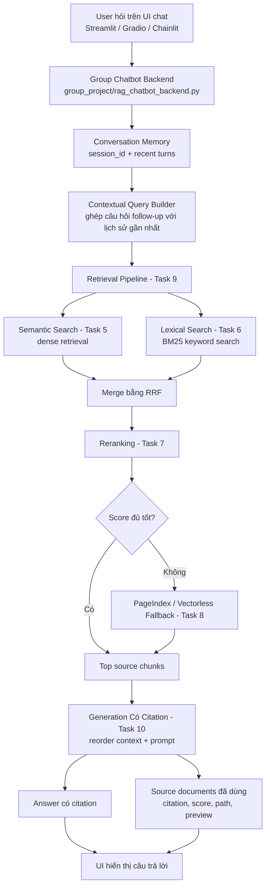

# Group Project — Full RAG Pipeline + Evaluation

## Mục Tiêu Hiện Tại

Build đầy đủ RAG pipeline cho chatbot hỏi đáp về pháp luật ma túy và tin tức liên quan, kèm evaluation pipeline. Trong giai đoạn chờ golden dataset mới, evaluation mặc định chạy sample 2 Q&A đầu tiên để smoke test toàn bộ pipeline.

---

## Kiến Trúc

```text
data/landing
  -> data/standardized
  -> Task 4 chunking + embedding + Weaviate index
  -> Task 5 semantic search
  -> Task 6 BM25 lexical search
  -> Task 9 RRF merge + optional rerank + PageIndex fallback
  -> Task 10 generation có citation
  -> app.py Streamlit chatbot + conversation memory + source display

group_project/evaluation/golden_dataset.json
  -> eval_pipeline.py
  -> DeepEval metrics
  -> A/B: hybrid+rerank vs hybrid no-rerank
  -> results.md
```

---

**Yêu cầu:**

- Giao diện chat (Streamlit / Gradio / Chainlit)
- Trả lời có citation (dựa trên Task 10)
- Hỗ trợ follow-up questions (conversation memory)
- Hiển thị source documents đã dùng

**Stack gợi ý:**

```
Chainlit/Streamlit → Retrieval (Task 9) → Generation (Task 10) → Display
```

---

## Yêu cầu 2: RAG Evaluation Pipeline

Sử dụng **1 trong 3 framework** sau để evaluate pipeline RAG của nhóm:

### Framework lựa chọn

| Framework                                         | Cài đặt               | Đặc điểm                                      |
| ------------------------------------------------- | ------------------------ | ------------------------------------------------- |
| [DeepEval](https://github.com/confident-ai/deepeval) | `pip install deepeval` | Nhiều metric built-in, dễ integrate với pytest |
| [RAGAS](https://github.com/explodinggradients/ragas) | `pip install ragas`    | Chuẩn industry cho RAG eval, 3 trục chính      |
| [TruLens](https://github.com/truera/trulens)         | `pip install trulens`  | Dashboard UI, feedback functions mạnh            |

### Yêu cầu Evaluation

1. **Tạo Golden Dataset** — tối thiểu 15 cặp Q&A (question, expected_answer, expected_context)
2. **Chạy evaluation** trên toàn bộ golden dataset với các metrics sau:
   - **Faithfulness** — câu trả lời có bám đúng context không?
   - **Answer Relevance** — câu trả lời có đúng câu hỏi không?
   - **Context Recall** — retriever có lấy đủ evidence không?
   - **Context Precision** — trong context lấy về, bao nhiêu % thực sự hữu ích?
3. **So sánh A/B** — chạy eval trên ít nhất 2 config khác nhau (ví dụ: có reranking vs không reranking, hoặc hybrid vs dense-only)
4. **Báo cáo** — bảng điểm + phân tích worst performers + đề xuất cải tiến

### Code mẫu — DeepEval

```python
from deepeval import evaluate
from deepeval.metrics import (
    FaithfulnessMetric,
    AnswerRelevancyMetric,
    ContextualRecallMetric,
    ContextualPrecisionMetric,
)
from deepeval.test_case import LLMTestCase

# Tạo test cases từ golden dataset
test_cases = []
for item in golden_dataset:
    result = rag_pipeline.generate_with_citation(item["question"])
    test_case = LLMTestCase(
        input=item["question"],
        actual_output=result["answer"],
        expected_output=item["expected_answer"],
        retrieval_context=[c["content"] for c in result["sources"]],
    )
    test_cases.append(test_case)

# Chạy evaluation
metrics = [
    FaithfulnessMetric(threshold=0.7),
    AnswerRelevancyMetric(threshold=0.7),
    ContextualRecallMetric(threshold=0.7),
    ContextualPrecisionMetric(threshold=0.7),
]

results = evaluate(test_cases, metrics)
```

Chạy N câu:

```bash
EVAL_LIMIT=8 python -m group_project.evaluation.eval_pipeline
```

Chạy toàn bộ dataset:

```bash
EVAL_LIMIT=0 python -m group_project.evaluation.eval_pipeline
```

---

## Pipeline Components

- [x] Data landing legal/news
- [x] Markdown standardized corpus
- [x] Chunking: recursive splitter, `chunk_size=900`, `chunk_overlap=120`
- [x] Embedding: `BAAI/bge-m3`, 1024 dimensions
- [x] Vector store: Weaviate collection `DrugLawDocs`
- [x] Dense retrieval: semantic search
- [x] Sparse retrieval: BM25 + PyVi tokenization
- [x] Fusion: Reciprocal Rank Fusion
- [x] Reranking: `BAAI/bge-reranker-v2-m3`
- [x] Fallback: PageIndex vectorless retrieval
- [x] Generation: OpenAI-compatible chat completion with citation prompt
- [x] Evaluation: DeepEval 4 metrics + A/B configs

---

## Cách Chạy

### 1. Cài dependencies

```bash
pip install -r requirements.txt
```

### 2. Cấu hình môi trường

- [X] File `group_project/evaluation/golden_dataset.json` — 15+ cặp Q&A
- [ ] File `group_project/evaluation/eval_pipeline.py` — script chạy evaluation
- [ ] File `group_project/evaluation/results.md` — bảng điểm + phân tích
- [ ] So sánh A/B ít nhất 2 configs

```bash
OPENAI_API_KEY=...
OPENAI_BASE_URL=...
LLM_MODEL=...

WEAVIATE_URL=...
WEAVIATE_API_KEY=...
WEAVIATE_COLLECTION=DrugLawDocs
```

Nếu dùng Ollama local, `OPENAI_BASE_URL` có thể trỏ về:

```bash
OPENAI_BASE_URL=http://localhost:11434/v1
OPENAI_API_KEY=ollama
LLM_MODEL=qwen2.5:7b-instruct
```

### 3. Build/rebuild index khi data thay đổi



**Luồng chính:** UI chỉ cần gọi backend bằng `session_id`. Backend tự lưu hội thoại gần nhất, biến câu hỏi follow-up thành contextual query, gọi Task 9 để lấy source chunks, gọi Task 10 để sinh câu trả lời có citation, rồi trả về cả `answer` và `source_documents` cho UI hiển thị.

### 4. Chạy chatbot

```bash
streamlit run app.py
```

### 5. Chạy evaluation

```bash
python -m group_project.evaluation.eval_pipeline
```
| Thành viên           | MSSV        | Nhiệm vụ                                                                                                                                           | Trạng thái |
| ---------------------- | ----------- | ---------------------------------------------------------------------------------------------------------------------------------------------------- | ------------ |
| Hoàng Văn Anh        | 2A202600762 | Craw data, convert to mark down, chunk index, RAG chatbot, Workflow system, Write mark down                                                          | Done         |
| Nguyễn Trường Giang | 2A202600792 | Chỉnh sửa evaluate.py để tích hợp các metric đánh giá + xây dựng golden_dataset.json làm bộ dữ liệu chuẩn phục vụ việc benchmark | Done         |
| Nguyễn Lý Minh Kỳ   | 2A202600782 | semantic search, reranking, retrieval pipeline, generation có citation ở backend, sample streamlit UI                                              | Done         |
| Phạm Ánh Dương     | 2A202600815 | Design and deploy, test chatbot                                                                                                                      |              |

---

## Việc Còn Lại Khi Có Golden Dataset Mới

- [ ] Thay/cập nhật `group_project/evaluation/golden_dataset.json`
- [ ] Chốt `expected_answer` và `expected_context`, bỏ các field `note` nếu không còn cần
- [ ] Chạy `EVAL_LIMIT=0 python -m group_project.evaluation.eval_pipeline`
- [ ] Review `results.md`: bảng A/B, worst performers, recommendations
- [ ] Nếu dataset có nhiều câu news, kiểm tra retrieval trên `data/standardized/news`

---

## Checklist Hoàn Thiện Theo Yêu Cầu

### Sản Phẩm RAG Chatbot

- [x] Có giao diện chat Streamlit
- [x] Có full RAG flow: retrieval -> generation -> answer
- [x] Câu trả lời yêu cầu citation theo source trong prompt
- [x] Có conversation memory cho follow-up
- [x] Có source display cho từng assistant response
- [x] Có control `top_k`
- [x] Có control bật/tắt reranking
- [x] Có xử lý lỗi pipeline để demo không crash UI

### RAG Evaluation Pipeline

- [x] Có `group_project/evaluation/golden_dataset.json`
- [x] Golden dataset hiện tại có 48 Q&A, vượt yêu cầu tối thiểu 15
- [x] Có `group_project/evaluation/eval_pipeline.py`
- [x] Có DeepEval judge/model setup
- [x] Có Faithfulness metric
- [x] Có Answer Relevancy metric
- [x] Có Contextual Recall metric
- [x] Có Contextual Precision metric
- [x] Có A/B config 1: hybrid + rerank
- [x] Có A/B config 2: hybrid no-rerank
- [x] No-rerank config dùng RRF trực tiếp, không bị fallback threshold sai thang điểm
- [x] Có `group_project/evaluation/results.md`
- [x] Có bảng điểm A/B cho sample 2 Q&A
- [x] Có phân tích worst performers hoặc ghi rõ không có case dưới threshold
- [x] Có recommendations
- [x] Có cách chạy sample 2 Q&A mặc định
- [x] Có cách chạy full dataset bằng `EVAL_LIMIT=0`

### Yêu Cầu Chung

- [x] Tích hợp pipeline từ các task cá nhân vào flow chung
- [x] Demo local bằng `streamlit run app.py`
- [x] Evaluation pipeline chạy được với sample 2 Q&A
- [x] README mô tả kiến trúc
- [x] README mô tả cách chạy
- [x] README có checklist trạng thái
- [ ] Cập nhật phân công thật của thành viên nhóm
- [ ] Push/commit lên repository chung
# Test nhanh backend chatbot không cần UI
python -m group_project.rag_chatbot_backend
```

UI team có thể tích hợp backend như sau:

```python
from group_project.rag_chatbot_backend import chat, reset_session

result = chat(
    "Tàng trữ trái phép chất ma túy bị xử lý như thế nào?",
    session_id="demo-user",
)

print(result["answer"])
print(result["source_documents"])
```

Output backend trả về các trường chính:

- `answer`: câu trả lời có citation.
- `source_documents`: danh sách source chunks đã dùng, gồm `citation`, `source_path`, `score`, `preview`.
- `citations`: danh sách citation xuất hiện trong câu trả lời.
- `history`: lịch sử hội thoại theo `session_id`, dùng cho follow-up questions.

---

## Phân Công Công Việc

| Thành viên | MSSV | Nhiệm vụ | Trạng thái |
|-----------|------|----------|------------|
| TBD | TBD | Data + standardized corpus | Done |
| TBD | TBD | Retrieval pipeline | Done |
| TBD | TBD | RAG chatbot UI | Done |
| TBD | TBD | Evaluation sample 2 Q&A + report | Done |
